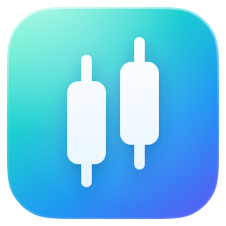
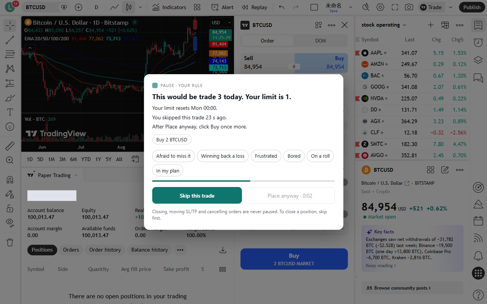
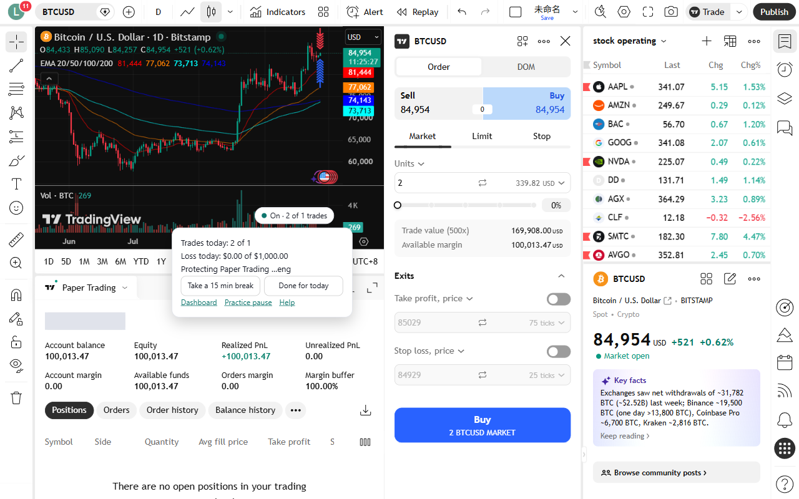

<div align="center">



# DisciplineGuard

### A pause at the click, before the trade that breaks your rules.

You wrote the rules when you were calm. DisciplineGuard holds you to them when you're not.

**[Start free →](https://disciplineguard.leowqiheng.workers.dev)** &nbsp;·&nbsp; MetaTrader 5 &nbsp;·&nbsp; TradingView &nbsp;·&nbsp; Polymarket &nbsp;·&nbsp; Free for 1 trading account

<br>



</div>

---

## The problem

Every trader knows the rules. Max 3 trades. Stop after 2 losses. No revenge trades.

Then a loss hits, the chart moves, and the rules are gone before the order is.

Journals only tell you afterwards. Lockout tools lock you out after the damage is done. **DisciplineGuard acts at the click, before the order.**

| | Acts | You decide? |
|---|---|---|
| Journals | After the trade | Too late for this one |
| Lockout tools | After the limit | No, you're locked out |
| **DisciplineGuard** | **At the click, before the order** | **Yes, every time** |

## How it works

1. **Set your rules.** Pick a starting template in two minutes, then tune it.
2. **Trade as usual.** Trades that keep your rules go straight through, with no delay.
3. **Break a rule, get a pause.** It names the rule and the number: *"This would be trade 3 today. Your limit is 1."* Skip it, or place it anyway after a short wait. Your call, every time.

Tightening a rule applies now. **Loosening one waits until your next day reset**, so a bad moment can't switch it off.

## 10 rules, in your own words

| | | |
|---|---|---|
| Max trades per day | Max trades per hour | Too fast |
| Trading hours | Max position size | Max risk per trade |
| Cooldown after a loss | Daily loss limit | Stop loss required |
| No bigger after a loss | | |

Plus **Take a break** (15 minutes to 30 days) and **Done for today**, and a morning check-in to tighten today's limits only.

**Close outside trades** (MT5, off until you turn it on): a trade placed on your phone, the web terminal or MetaTrader's own order window can't be paused, so DisciplineGuard closes it within seconds if it goes past a rule. A missing stop loss alone gets 60 seconds to be added. Trades from other EAs are never closed.

<div align="center">

</div>

## Platforms

| Platform | How | Status |
|---|---|---|
| **MetaTrader 5** (Windows) | The Windows app sets MT5 up for you. No files to copy, nothing to type. Works with prop firm and broker accounts. | ✅ Live |
| **TradingView** (Chrome, Edge) | Browser extension. Pauses the order panel and one-click Buy/Sell. | ✅ Live |
| **Polymarket** (Chrome, Edge) | The same browser extension. Pauses Buy in the trade box (market orders). Sell is never paused. | ✅ New |
| MT4, cTrader, NinjaTrader, web prop platforms | | Planned |

## What it never does

- **Closing a trade is never paused.** Nor are moving SL/TP or cancelling orders.
- **We never make an order wait for our server.** Rules are checked on your computer.
- **We never see your broker password**, and never open, change or close a trade unless you click to do it or turn on Close outside trades.

## Get started

1. Sign in at **[disciplineguard.leowqiheng.workers.dev](https://disciplineguard.leowqiheng.workers.dev)** with Google and set your rules.
2. Connect your platform:
   - **MT5:** download the [Windows app](https://disciplineguard.leowqiheng.workers.dev/downloads/DisciplineGuard-Setup.exe), click **Allow**, tick your MetaTrader, then **Protect**.
   - **TradingView or Polymarket:** follow [Install the TradingView extension](https://disciplineguard.leowqiheng.workers.dev/help/tradingview) (download, unzip, *Load unpacked*).
3. Trade.

**Free for everyone: every rule, on 1 trading account.** TradingView Paper Trading doesn't count toward it. Plans for more accounts are coming.

> The Windows app isn't code-signed yet, so Windows may say *"Windows protected your PC"* the first time. Click **More info → Run anyway**.

---

## For developers

The whole product is open source in this repository.

```
server/            Cloudflare Worker: API, sync, sign-in, jobs (TypeScript, D1)
web/               The web app and site (React, Vite)
packages/core/     The rules engine, shared by the server, web and extension
clients/mt5/       The MT5 Expert Advisor (MQL5)
clients/windows/   The Windows app that installs and bridges the EA (Tauri, Rust)
clients/extension/ The TradingView extension (Chrome and Edge, MV3)
```

```bash
npm install
npm test
npm run typecheck
```

Run locally with `npm run dev -w server` and `npm run dev -w web`. The EA compiles with `clients/mt5/compile.ps1`, and `clients/mt5/tests/close-tests.ps1` runs Close outside trades in MT5's Strategy Tester (simulated trades only). Releases are built by the **Windows app** workflow in GitHub Actions.

How it behaves is in [SPEC.md](SPEC.md), what it says and shows is in [EXPERIENCE.md](EXPERIENCE.md), and what's next is in [PHASES.md](PHASES.md).

The code is public to read, not to reuse: see [LICENSE](LICENSE).

<div align="center">
<br>
<sub>Built by a trader, for traders who know their rules and want to keep them.</sub>
</div>
