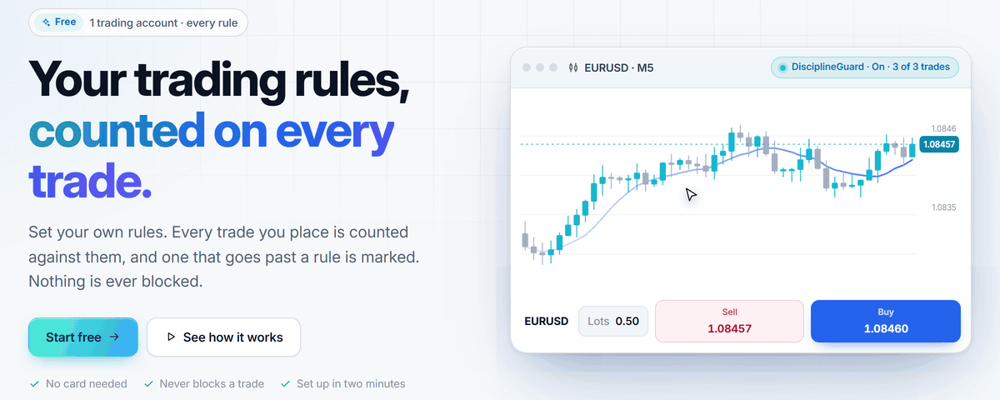
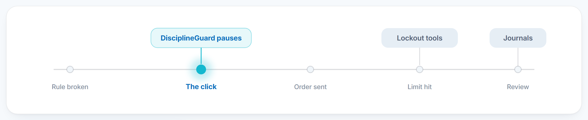
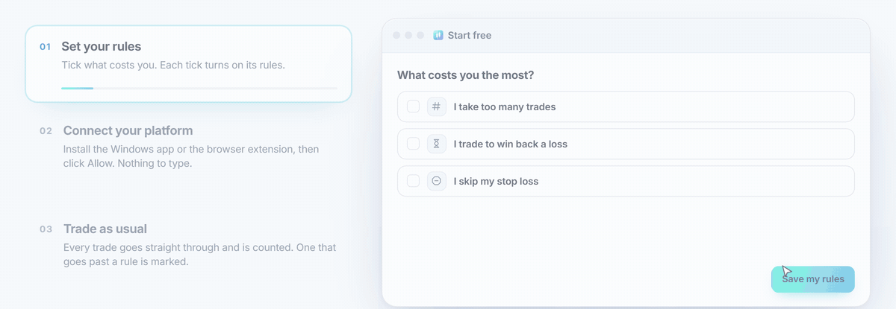
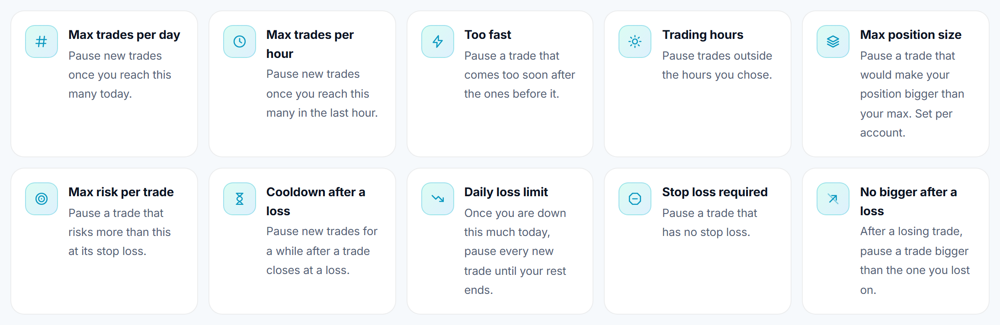
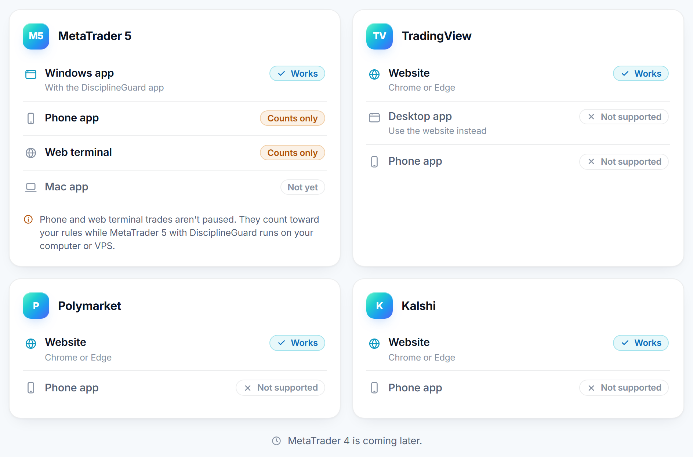

<div align="center">


# DisciplineGuard

<a href="https://disciplineguard.leowqiheng.workers.dev"></a>

<p>
<a href="https://disciplineguard.leowqiheng.workers.dev/start"></a>&nbsp;&nbsp;<a href="https://disciplineguard.leowqiheng.workers.dev/downloads/DisciplineGuard-Setup.exe"></a>&nbsp;&nbsp;<a href="https://disciplineguard.leowqiheng.workers.dev/help/tradingview"></a>
</p>

**Works with** &nbsp; MetaTrader 5 <sub>Windows app</sub> &nbsp;·&nbsp; TradingView <sub>website</sub> &nbsp;·&nbsp; Polymarket <sub>website</sub> &nbsp;·&nbsp; Kalshi <sub>website</sub>

</div>

<br>

## The moment that matters is the click



Journals act after the trade. Lockout tools act after the limit and lock you out. **DisciplineGuard acts at the click, before the order, and you still decide.**

## Three steps. Then you trade.



## Ten rules. Your numbers.



Tightening a rule applies now. **Loosening one waits until your next day reset**, so a bad moment can't switch it off. Plus **Take a break** (15 minutes to 30 days), **Done for today**, and a morning check-in to tighten today's limits only.

**Close outside trades** (MT5, off until you turn it on): a trade placed on your phone, the web terminal or MetaTrader's own order window can't be paused, so DisciplineGuard closes it within seconds if it goes past a rule. A missing stop loss alone gets 60 seconds to be added. Trades from other EAs are never closed.

## Your platform, on your computer



- **MetaTrader 5:** the Windows app sets MT5 up for you: no files to copy, nothing to type. Prop firm and broker accounts.
- **TradingView:** pauses the order panel and one-click Buy/Sell.
- **Polymarket:** pauses Buy in the trade box (market orders). Sell is never paused.
- **Kalshi:** pauses Submit Buy and Buy with 1-Click (dollars or shares). Sell is never paused.

## On a real chart


## What it never does

- **Closing a trade is never paused.** Nor are moving SL/TP or cancelling orders.
- **We never make an order wait for our server.** Rules are checked on your computer.
- **We never see your broker password**, and never open, change or close a trade unless you click to do it or turn on Close outside trades.

## Get started

1. Click **[Start free](https://disciplineguard.leowqiheng.workers.dev/start)**, tick where you trade and set your rules. Sign in with Google or email to save them.
2. Connect your platform. The last step shows each one live as it connects:
   - **MT5:** download the [Windows app](https://disciplineguard.leowqiheng.workers.dev/downloads/DisciplineGuard-Setup.exe), click **Allow**, tick your MetaTrader, then **Protect**.
   - **TradingView, Polymarket or Kalshi:** [install the browser extension](https://disciplineguard.leowqiheng.workers.dev/help/tradingview) (download, unzip, *Load unpacked*), then **Sign in** and **Allow**.
3. Trade.

**Free for everyone: every rule, on 1 trading account.** TradingView Paper Trading doesn't count toward it. Plans for more accounts are coming.

> The Windows app isn't code-signed yet, so Windows may say *"Windows protected your PC"* the first time. Click **More info → Run anyway**.

<div align="center">
<br>
<a href="https://disciplineguard.leowqiheng.workers.dev/start"></a>
<br><br>
<sub>A pause before the trade that costs you. Your rules. Your call. Every time.</sub>
</div>

---

## For developers

The whole product is open source in this repository.

```
server/            Cloudflare Worker: API, sync, sign-in, jobs (TypeScript, D1)
web/               The web app and site (React, Vite)
packages/core/     The rules engine, shared by the server, web and extension
clients/mt5/       The MT5 Expert Advisor (MQL5)
clients/windows/   The Windows app that installs and bridges the EA (Tauri, Rust)
clients/extension/ The TradingView extension (Chrome and Edge, MV3)
```

```bash
npm install
npm test
npm run typecheck
```

Run locally with `npm run dev -w server` and `npm run dev -w web`. The EA compiles with `clients/mt5/compile.ps1`. `clients/mt5/tests/core-tests.ps1` checks the EA's rules engine against the TypeScript one, and `clients/mt5/tests/close-tests.ps1` runs Close outside trades in MT5's Strategy Tester (simulated trades only). Releases are built by the **Windows app** workflow in GitHub Actions.

How it behaves is in [SPEC.md](SPEC.md), what it says and shows is in [EXPERIENCE.md](EXPERIENCE.md), and what's next is in [PHASES.md](PHASES.md).

The code is public to read, not to reuse: see [LICENSE](LICENSE).

<div align="center">
<br>
<sub>Built by a trader, for traders who know their rules and want to keep them.</sub>
</div>
